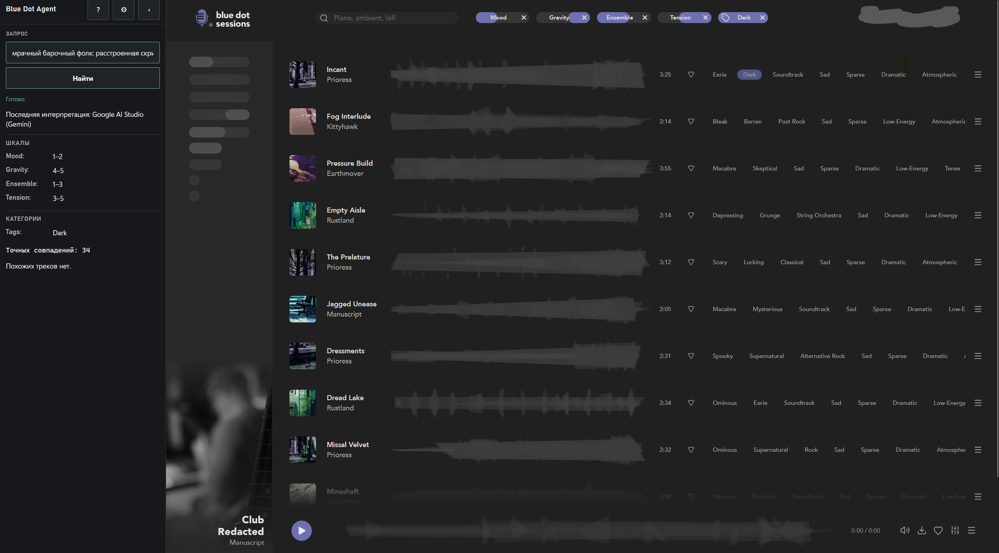
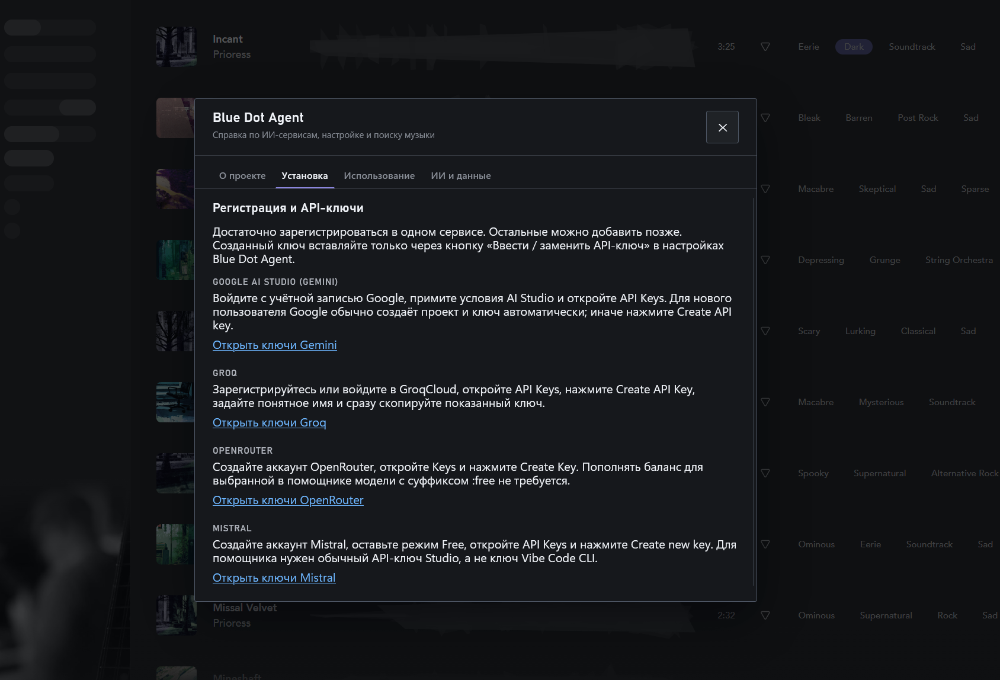
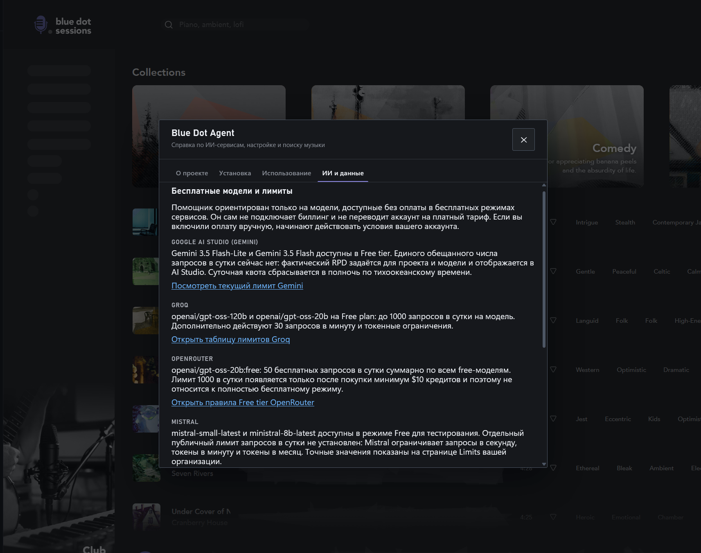

# Blue Dot Agent

Локальный ИИ-помощник для поиска музыки в [Blue Dot Sessions](https://app.sessions.blue/browse). Он понимает свободный человеческий запрос, переводит его в шкалы и категории Blue Dot и применяет фильтры одним обновлением страницы поиска.

## Как это выглядит

### Поиск по обычному человеческому запросу



### Встроенная справка

Помощник объясняет, где получить API-ключи и какие ограничения действуют у бесплатных моделей.
Интерфейс настольной панели переключается между русским и английским языками; выбор сохраняется между запусками.





## Скачать

На странице [Releases](https://github.com/pereponkin/BluedotApp/releases) публикуются автономные пакеты, которым не нужны отдельно установленные Python, PowerShell или библиотеки:

- `BlueDotAgent-Setup-Windows-x64.exe` — установщик Windows;
- `BlueDotAgent-Windows-x64.zip` — portable-версия Windows;
- `BlueDotAgent-macOS-x64.zip` — macOS Intel;
- `BlueDotAgent-macOS-arm64.zip` — macOS Apple Silicon;
- `SHA256SUMS.txt` — контрольные суммы файлов выпуска.

Пакеты не содержат браузер и поэтому остаются компактными. Для Chrome используется обычный Google Chrome, установленный в системе. Если выбран Firefox, агент один раз предложит скачать совместимую сборку Playwright (около 120 МБ) и сохранит её в своей папке данных. Обычный Firefox с сайта Mozilla для автоматизации Playwright не используется. Позднее браузер можно изменить под шестерёнкой; выбор вступит в силу при следующем запуске.

Деинсталлятор Windows по умолчанию сохраняет настройки, API-ключи и браузерные профили для будущей переустановки. При обычном удалении он отдельно предлагает стереть эти данные; тихая деинсталляция всегда их сохраняет.

## Первый запуск

1. Запустите Blue Dot Agent и выберите Firefox или Google Chrome. При выборе Firefox подтвердите его разовую загрузку.
2. Один раз войдите в Blue Dot Sessions в открывшемся отдельном профиле агента.
3. Откройте настройки `⚙`, выберите ИИ-сервис и модель.
4. Нажмите «Ввести / заменить API-ключ» и вставьте ключ в системное окно.
5. Опишите нужную музыку обычными словами и нажмите Enter или «Найти».

Агент не использует ваш личный профиль браузера. Firefox и Chrome имеют отдельные агентские профили, поэтому вход для каждого браузера выполняется отдельно. Смена ИИ-сервиса не удаляет ключи других сервисов.

## Предупреждения неподписанных приложений

Пакеты не подписаны коммерческими сертификатами и не нотариализованы Apple.

### Windows SmartScreen

Если SmartScreen показывает предупреждение, нажмите «Подробнее» → «Выполнить в любом случае». Перед запуском можно сверить SHA-256 файла с `SHA256SUMS.txt` на странице выпуска.

### macOS Gatekeeper

Официальный безопасный путь для первой попытки запуска:

1. Откройте `BlueDotAgent.app` обычным двойным щелчком и дождитесь предупреждения.
2. Откройте `System Settings` → `Privacy & Security`.
3. Внизу страницы рядом с сообщением о Blue Dot Agent нажмите `Open Anyway`.
4. Подтвердите кнопкой `Open`.

Не отключайте Gatekeeper целиком и не удаляйте quarantine-атрибуты массовыми командами.

## Возможности

- ИИ-интерпретация через бесплатные модели Google Gemini, Groq, OpenRouter или Mistral.
- Шкалы `Mood`, `Density`, `Energy`, `Gravity`, `Ensemble`, `Melody`, `Tension`, `Rhythm`, `BPM`, `Length`.
- Категории `Tags`, `Genres`, `Instruments` и `Keys`.
- Повторные запросы и история фильтров без перезагрузки вкладки.
- Выбор папки загрузок, видимый статус скачивания и открытие скачанного файла из панели.
- Встроенная справка по регистрации в ИИ-сервисах, API-ключам и бесплатным лимитам.

Artlist и Epidemic пока представлены только инвентарём фильтров; рабочих адаптеров для них нет.

## Данные и секреты

| Данные | Windows | macOS |
|---|---|---|
| Настройки и профили | `%LOCALAPPDATA%\BlueDotAgent` | `~/Library/Application Support/BlueDotAgent` |
| API-ключи | DPAPI текущего пользователя | системный Keychain |
| Загруженный Playwright Firefox | `%LOCALAPPDATA%\BlueDotAgent\browsers` | `~/Library/Application Support/BlueDotAgent/browsers` |
| Загрузки | системная папка «Загрузки» | `~/Downloads` |

Ключи не помещаются в DOM страницы, обычный JSON или логи. Поддерживаются переменные `GEMINI_API_KEY`, `GROQ_API_KEY`, `OPENROUTER_API_KEY`, `MISTRAL_API_KEY`, а также `BLUEDOT_BROWSER`, `BLUEDOT_STATE_DIR`, `BLUEDOT_PROFILE_DIR`, `BLUEDOT_LOG_DIR` и `BLUEDOT_DOWNLOAD_DIR`.

Существующие настройки Windows версии 1 автоматически обновляются до версии 2 с браузером Firefox. Старый профиль `.browser-profile` переносится без кэшей и stale lock-файла, поэтому повторный вход обычно не нужен. Второй экземпляр агента блокируется общим Python-лаунчером.

## Самопроверка пакета

Проверка ресурсов, путей, защищённого хранилища и выбранного браузера не требует аккаунта Blue Dot или API-ключа:

```text
BlueDotAgent.exe --self-test --browser firefox
BlueDotAgent.app/Contents/MacOS/BlueDotAgent --self-test --browser firefox
```

В автономном пакете поле `frozen` должно быть `true`. Для ещё не загруженного Firefox успешный результат содержит `browser_status: "download_required"`: установщик браузера присутствует, а сама загрузка начнётся только после выбора Firefox в графическом интерфейсе.

## Разработка

Нужен Python 3.11 и Node.js для проверки синтаксиса панели:

```text
python -m venv .venv
python -m pip install -r requirements.lock -e . pytest
python -m playwright install firefox chromium
python -m pytest -q
node --check bluedot_agent/panel.js
```

Запуск из исходников:

```text
python -m bluedot_agent --browser firefox panel
python -m bluedot_agent --browser chrome panel
```

`BLUEDOT_BROWSER` и сохранённая настройка используются, если `--browser` не указан. Без команды запускается панель.

## Сборки и CI

`.github/workflows/ci.yml` проверяет Windows, macOS Intel и macOS Apple Silicon, полный pytest, синтаксис `panel.js`, панель в Playwright Firefox и Chromium, а также smoke-test системного Chrome.

`.github/workflows/release.yml` запускается вручную или тегом `v*`, собирает компактный PyInstaller `--onedir --windowed` без браузеров, распаковывает готовый архив вне репозитория, выполняет frozen `--self-test`, создаёт установщик Inno Setup, ZIP-пакеты и SHA-256. Intel-сборка не выдаётся за ARM64: если GitHub runner `macos-15` недоступен репозиторию, выпуск блокируется до появления настоящего Apple Silicon runner.

В Actions используются только локальные тестовые страницы и моки. Cookies, аккаунты Blue Dot и реальные API-ключи в CI не нужны и не должны добавляться.

## Поддерживаемые платформы

Официальная матрица: Windows x64 и macOS 15+ (Intel или Apple Silicon), Firefox или установленный Google Chrome. Linux, Safari, Edge, автоматическое обновление, личные браузерные профили, Apple Developer Program и нотариализация не входят в текущую версию.
